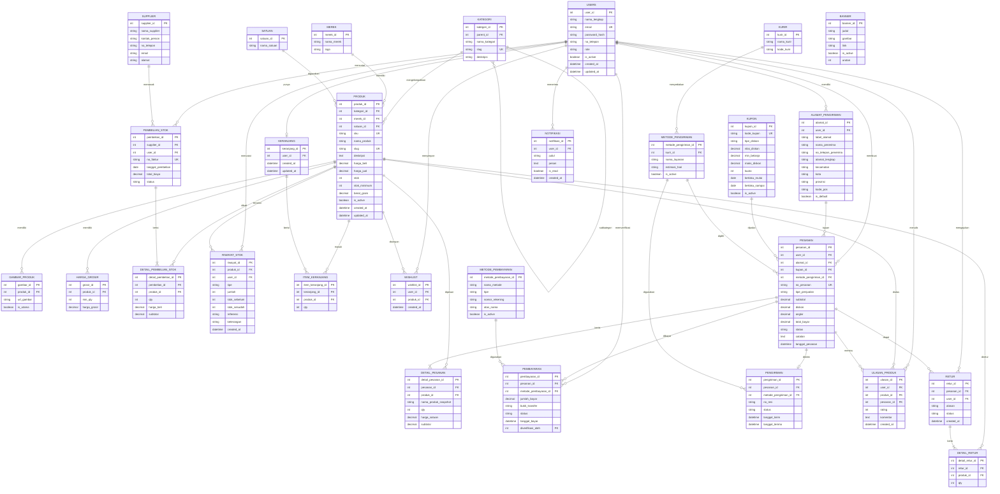

```mermaid
erDiagram
    USERS {
        int user_id PK
        string nama_lengkap
        string email UK
        string password_hash
        string no_telepon
        string role
        boolean is_active
        datetime created_at
        datetime updated_at
    }

    ALAMAT_PENGIRIMAN {
        int alamat_id PK
        int user_id FK
        string label_alamat
        string nama_penerima
        string no_telepon_penerima
        string alamat_lengkap
        string kecamatan
        string kota
        string provinsi
        string kode_pos
        boolean is_default
    }

    KATEGORI {
        int kategori_id PK
        int parent_id FK
        string nama_kategori
        string slug UK
        string deskripsi
    }

    MEREK {
        int merek_id PK
        string nama_merek
        string logo
    }

    SATUAN {
        int satuan_id PK
        string nama_satuan
    }

    PRODUK {
        int produk_id PK
        int kategori_id FK
        int merek_id FK
        int satuan_id FK
        string sku UK
        string nama_produk
        string slug UK
        text deskripsi
        decimal harga_beli
        decimal harga_jual
        int stok
        int stok_minimum
        decimal berat_gram
        boolean is_active
        datetime created_at
        datetime updated_at
    }

    GAMBAR_PRODUK {
        int gambar_id PK
        int produk_id FK
        string url_gambar
        boolean is_utama
    }

    HARGA_GROSIR {
        int grosir_id PK
        int produk_id FK
        int min_qty
        decimal harga_grosir
    }

    SUPPLIER {
        int supplier_id PK
        string nama_supplier
        string kontak_person
        string no_telepon
        string email
        string alamat
    }

    PEMBELIAN_STOK {
        int pembelian_id PK
        int supplier_id FK
        int user_id FK
        string no_faktur UK
        date tanggal_pembelian
        decimal total_biaya
        string status
    }

    DETAIL_PEMBELIAN_STOK {
        int detail_pembelian_id PK
        int pembelian_id FK
        int produk_id FK
        int qty
        decimal harga_beli
        decimal subtotal
    }

    RIWAYAT_STOK {
        int riwayat_id PK
        int produk_id FK
        int user_id FK
        string tipe
        int jumlah
        int stok_sebelum
        int stok_sesudah
        string referensi
        string keterangan
        datetime created_at
    }

    KERANJANG {
        int keranjang_id PK
        int user_id FK
        datetime created_at
        datetime updated_at
    }

    ITEM_KERANJANG {
        int item_keranjang_id PK
        int keranjang_id FK
        int produk_id FK
        int qty
    }

    WISHLIST {
        int wishlist_id PK
        int user_id FK
        int produk_id FK
        datetime created_at
    }

    KUPON {
        int kupon_id PK
        string kode_kupon UK
        string tipe_diskon
        decimal nilai_diskon
        decimal min_belanja
        decimal maks_diskon
        int kuota
        date berlaku_mulai
        date berlaku_sampai
        boolean is_active
    }

    PESANAN {
        int pesanan_id PK
        int user_id FK
        int alamat_id FK
        int kupon_id FK
        int metode_pengiriman_id FK
        string no_pesanan UK
        string tipe_penjualan
        decimal subtotal
        decimal diskon
        decimal ongkir
        decimal total_bayar
        string status
        text catatan
        datetime tanggal_pesanan
    }

    DETAIL_PESANAN {
        int detail_pesanan_id PK
        int pesanan_id FK
        int produk_id FK
        string nama_produk_snapshot
        int qty
        decimal harga_satuan
        decimal subtotal
    }

    METODE_PEMBAYARAN {
        int metode_pembayaran_id PK
        string nama_metode
        string tipe
        string nomor_rekening
        string atas_nama
        boolean is_active
    }

    PEMBAYARAN {
        int pembayaran_id PK
        int pesanan_id FK
        int metode_pembayaran_id FK
        decimal jumlah_bayar
        string bukti_transfer
        string status
        datetime tanggal_bayar
        int diverifikasi_oleh FK
    }

    KURIR {
        int kurir_id PK
        string nama_kurir
        string kode_kurir
    }

    METODE_PENGIRIMAN {
        int metode_pengiriman_id PK
        int kurir_id FK
        string nama_layanan
        string estimasi_hari
        boolean is_active
    }

    PENGIRIMAN {
        int pengiriman_id PK
        int pesanan_id FK
        int metode_pengiriman_id FK
        string no_resi
        string status
        datetime tanggal_kirim
        datetime tanggal_terima
    }

    ULASAN_PRODUK {
        int ulasan_id PK
        int user_id FK
        int produk_id FK
        int pesanan_id FK
        int rating
        text komentar
        datetime created_at
    }

    RETUR {
        int retur_id PK
        int pesanan_id FK
        int user_id FK
        string alasan
        string status
        datetime created_at
    }

    DETAIL_RETUR {
        int detail_retur_id PK
        int retur_id FK
        int produk_id FK
        int qty
    }

    NOTIFIKASI {
        int notifikasi_id PK
        int user_id FK
        string judul
        text pesan
        boolean is_read
        datetime created_at
    }

    BANNER {
        int banner_id PK
        string judul
        string gambar
        string link
        boolean is_active
        int urutan
    }

    USERS ||--o{ ALAMAT_PENGIRIMAN : memiliki
    USERS ||--o| KERANJANG : punya
    USERS ||--o{ WISHLIST : menyimpan
    USERS ||--o{ PESANAN : membuat
    USERS ||--o{ ULASAN_PRODUK : menulis
    USERS ||--o{ NOTIFIKASI : menerima
    USERS ||--o{ RETUR : mengajukan
    USERS ||--o{ PEMBELIAN_STOK : mencatat
    USERS ||--o{ RIWAYAT_STOK : mencatat
    USERS ||--o{ PEMBAYARAN : memverifikasi

    KATEGORI ||--o{ KATEGORI : subkategori
    KATEGORI ||--o{ PRODUK : mengelompokkan
    MEREK ||--o{ PRODUK : memiliki
    SATUAN ||--o{ PRODUK : digunakan

    PRODUK ||--o{ GAMBAR_PRODUK : memiliki
    PRODUK ||--o{ HARGA_GROSIR : memiliki
    PRODUK ||--o{ ITEM_KERANJANG : masuk
    PRODUK ||--o{ WISHLIST : disimpan
    PRODUK ||--o{ DETAIL_PESANAN : dipesan
    PRODUK ||--o{ ULASAN_PRODUK : diulas
    PRODUK ||--o{ DETAIL_PEMBELIAN_STOK : dibeli
    PRODUK ||--o{ RIWAYAT_STOK : tercatat
    PRODUK ||--o{ DETAIL_RETUR : diretur

    KERANJANG ||--o{ ITEM_KERANJANG : berisi

    SUPPLIER ||--o{ PEMBELIAN_STOK : memasok
    PEMBELIAN_STOK ||--|{ DETAIL_PEMBELIAN_STOK : berisi

    ALAMAT_PENGIRIMAN ||--o{ PESANAN : tujuan
    KUPON ||--o{ PESANAN : dipakai
    METODE_PENGIRIMAN ||--o{ PESANAN : dipilih
    PESANAN ||--|{ DETAIL_PESANAN : berisi
    PESANAN ||--o{ PEMBAYARAN : dibayar
    PESANAN ||--o| PENGIRIMAN : dikirim
    PESANAN ||--o{ ULASAN_PRODUK : memicu
    PESANAN ||--o{ RETUR : dapat

    METODE_PEMBAYARAN ||--o{ PEMBAYARAN : digunakan

    KURIR ||--o{ METODE_PENGIRIMAN : menyediakan
    METODE_PENGIRIMAN ||--o{ PENGIRIMAN : digunakan

    RETUR ||--|{ DETAIL_RETUR : berisi
```
